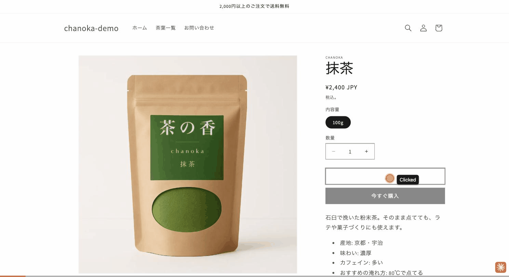
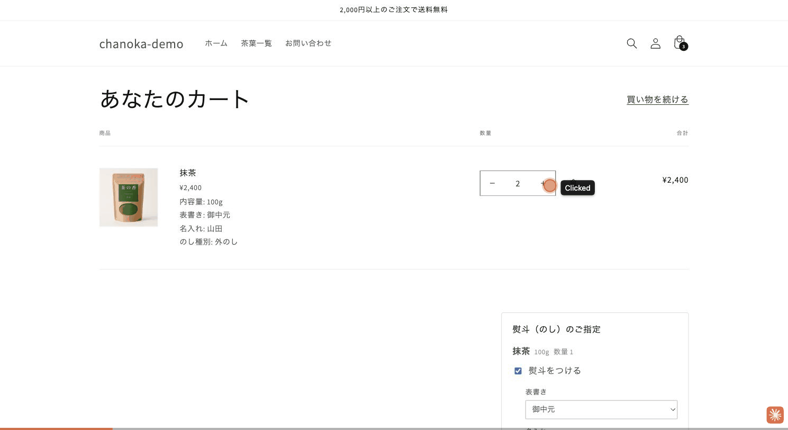
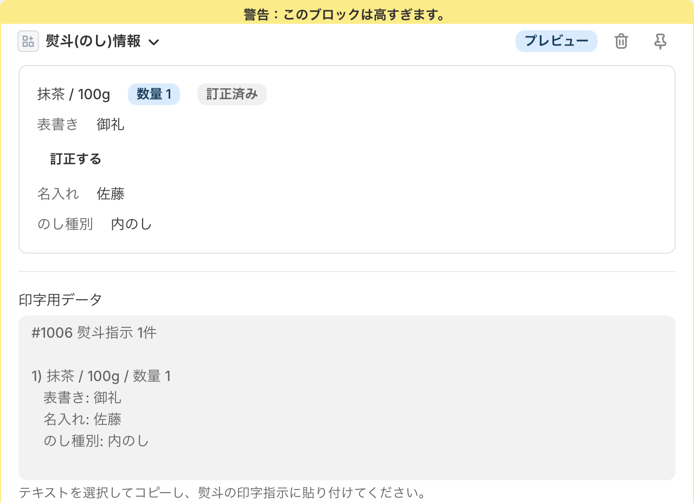
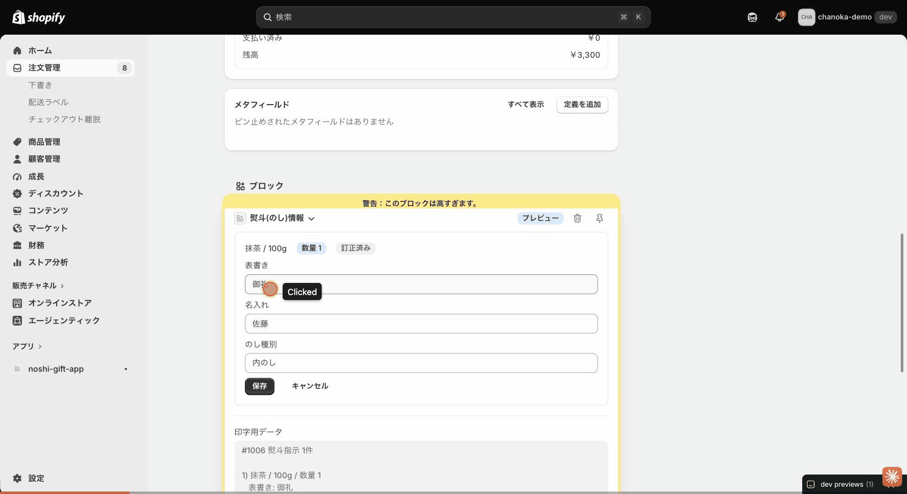
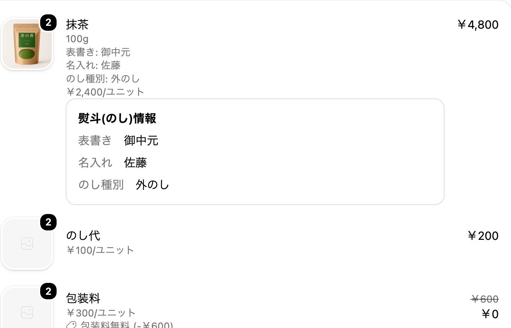

# chanoka のし・ギフト対応アプリ


副業ポートフォリオ用に構築した、Shopifyアプリです。日本の贈答ECに特有の
「熨斗（のし）・ギフト対応」（熨斗の要否・表書き・名入れ・外のし／内のし）を、
Shopifyの拡張機能だけで実現します。架空の日本茶ブランド「chanoka（茶の香）」の
デモストアに実際にインストールして動かしています。

このリポジトリはポートフォリオとして公開しているものであり、クライアント案件の成果物ではありません。
掲載しているブランド・商品・人物名はすべて架空のものです。

## デモ

本アプリの成果は Admin 画面・チェックアウト・注文ステータスページの中にしか現れず、
ストアURLを渡すだけでは動作を見せられません。そのため画面録画・スクリーンショットを
`docs/demo/` にまとめています。

| | |
|---|---|
| カートで熨斗を指定 → 料金加算 |  |
| 一定金額到達で包装料が無料になる |  |
| 受注画面の熨斗情報カード・印字用データ |  |
| 受注後の熨斗の訂正 |  |
| 購入者側の注文ステータスページ |  |

## アーキテクチャ

**extension-only app**（custom distribution）。開発者側のWebサーバーを持たず、
Shopifyがホストする拡張機能だけで構成しています。月額のホスティング費用が
発生しない構成を意図的に選んでいます。

```
カートページ（Theme App Extension）
  → line item properties（表書き・名入れ・のし種別）＋ 独立したカート行（のし代・包装料）
      → Discount Function（一定金額以上で包装料を100%割引）
          → 注文確定
              → Admin UI Extension（受注画面に熨斗カード・印字用データ・訂正機能）
              → Customer Account UI Extension（購入者の注文ステータスページに熨斗カード）
```

表書きの選択肢はMetaobjectで持ち、コードにハードコードしていません
（マーチャントが管理画面から増減できます）。

## 拡張機能構成

| ディレクトリ | 種別 | 役割 |
|---|---|---|
| `extensions/noshi-cart` | Theme App Extension | カートページの熨斗入力ブロック。のし代・包装料を独立行として追加 |
| `extensions/noshi-wrap-free` | Discount Function | 一定金額以上で包装料を無料に |
| `extensions/noshi-order-block` | Admin UI Extension | 受注画面に熨斗情報カード・印字用データを表示し、受注後の訂正を受け付ける |
| `extensions/noshi-order-status` | Customer Account UI Extension | 購入者の注文ステータスページに熨斗情報カードを表示 |

## 技術スタック

- Shopify CLI / extension-only app（custom distribution）
- Preact + Polaris web components（Admin UI Extension / Customer Account UI Extension）
- Shopify Functions（Discount）/ Vitest によるfixtureテスト
- GitHub Actions（Functionsの自動テストをCIで実行）

## ドキュメント

- `docs/spec.md` — 実装仕様書。何を作るか・実装状況・実装時の注意
- `docs/design/` — 要件定義書・基本設計書・詳細設計書の三層
- `docs/requirements.md` — 技術検証の実測ログ
- `docs/context.md` — 背景・開発ストアの現状・進捗

## ローカル環境での検証

```bash
npm ci
npm run dev  # shopify app dev
```

Functionsのfixtureテストは以下で実行できます（GitHub Actionsでも同じコマンドを実行）。

```bash
cd extensions/noshi-wrap-free
npm test -- --run
```
