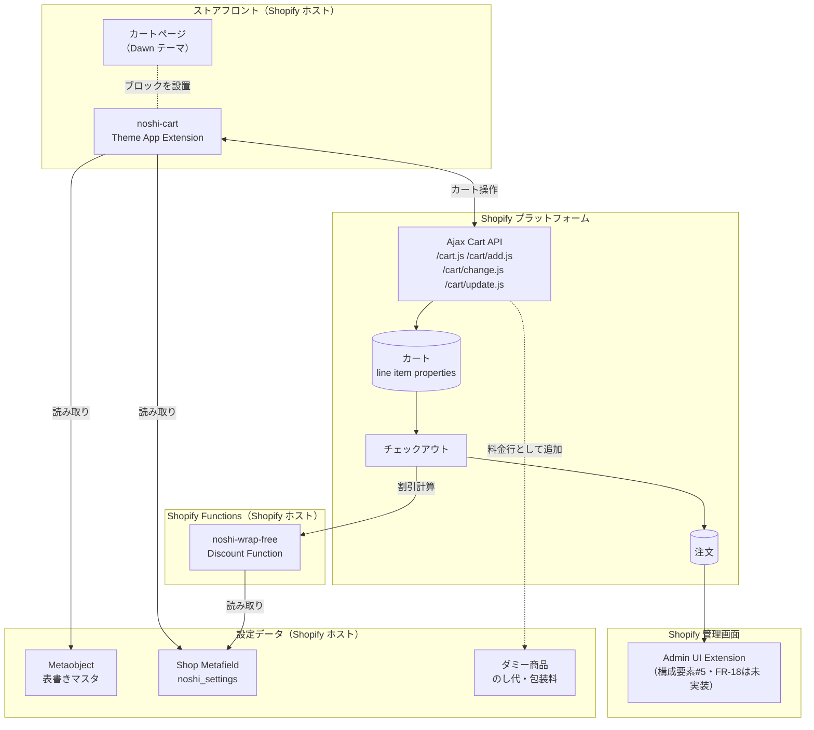
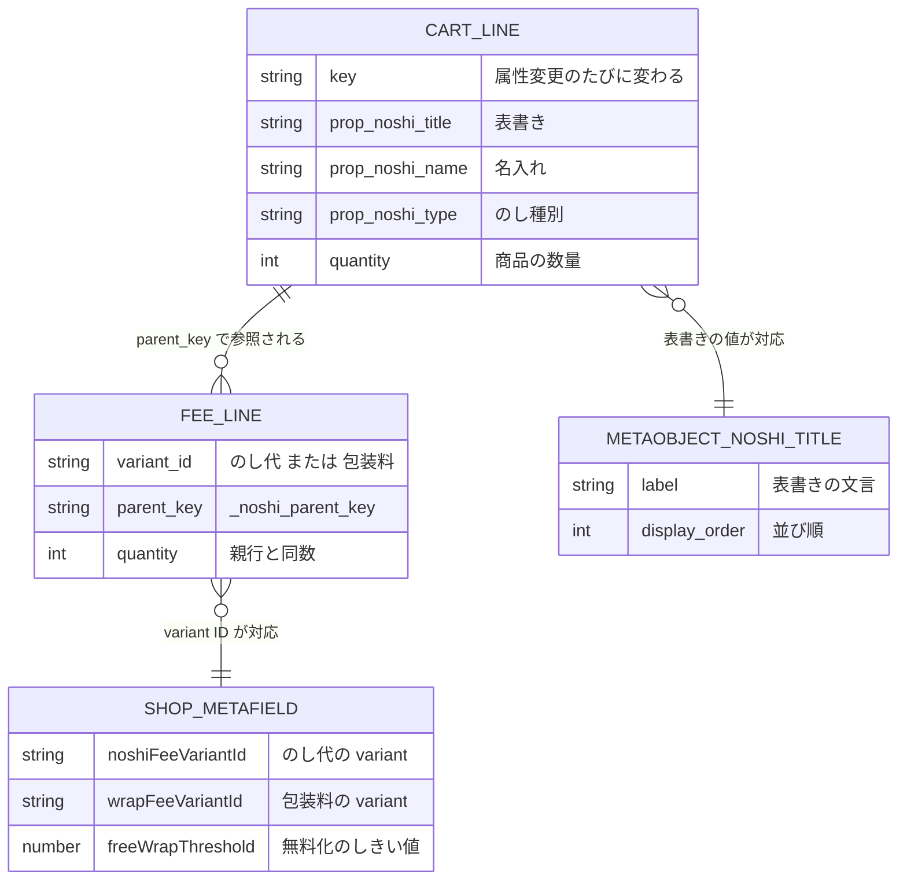
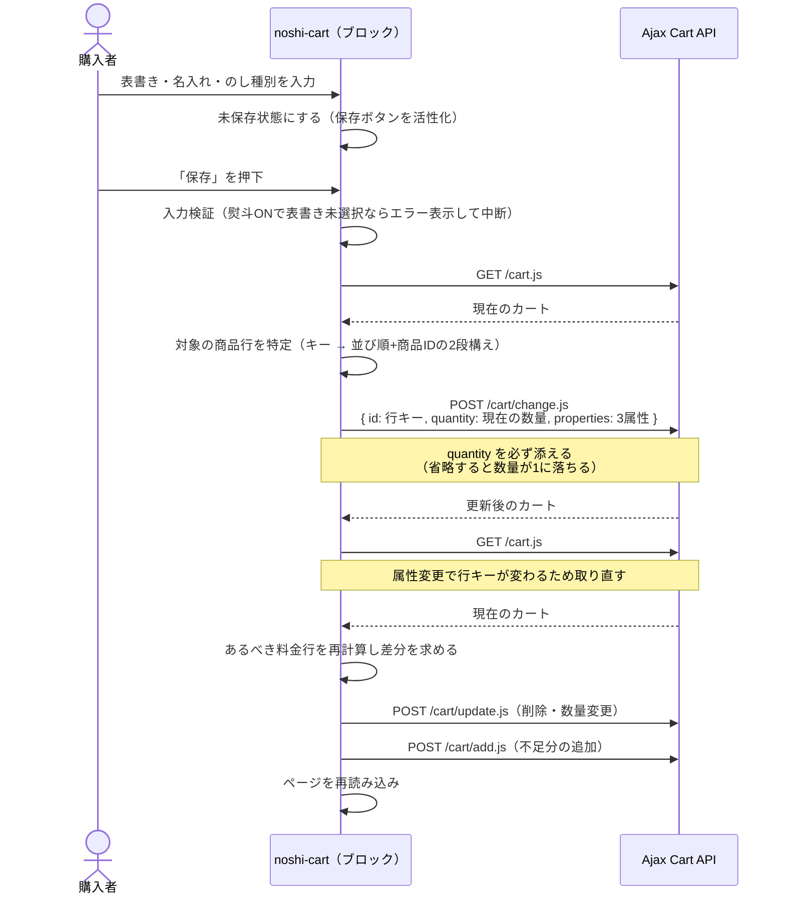
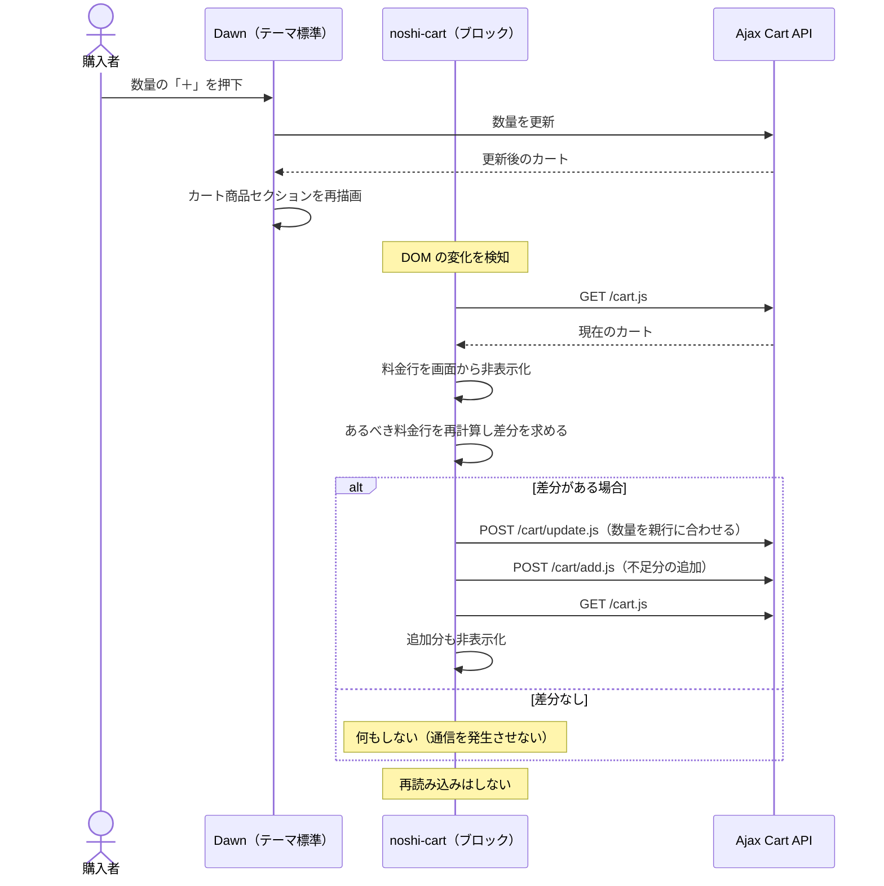
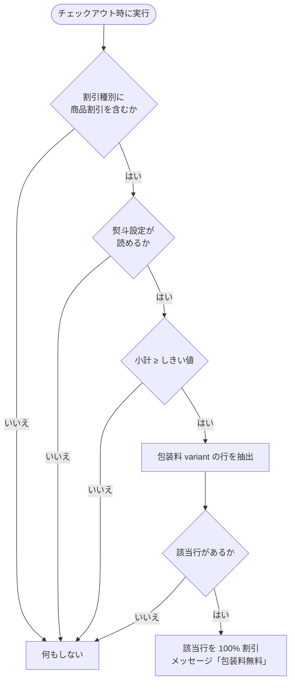

# 基本設計書

**システム名**: chanoka のし・ギフト対応アプリ（`noshi-gift-app`）
**版**: 1.0（2026-08-14）
**前提文書**: [要件定義書](./01-requirements.md)

---

## 1. 本書の位置づけ

[要件定義書](./01-requirements.md)で定義した要件を**どの方式で実現するか**を定義する。
ファイル単位・関数単位の仕様は [詳細設計書](./03-detailed-design.md) に記す。

本書では特に「**なぜその方式を選んだか**」を明記する。Shopify のプラットフォーム制約下では
実現方式の選択肢が限られ、かつ選択を誤ると後から戻せない箇所があるため、
判断の根拠を残すことを設計文書の主目的の一つとしている。

---

## 2. システム構成

### 2.1 全体構成

開発者側のサーバーを持たない **extension-only アプリ**として構成する。
すべての実行環境を Shopify がホストする。



### 2.2 コンポーネント一覧

| # | コンポーネント | 種別 | 責務 | 状態 |
|---|---|---|---|---|
| C-01 | `extensions/noshi-cart` | Theme App Extension | カートページの熨斗入力 UI、料金行の追加・整合・非表示化 | 実装済み |
| C-02 | `extensions/noshi-wrap-free` | Shopify Function（Discount） | 小計が一定額以上のとき包装料の行を 100% 割引 | 実装済み |
| C-03 | `extensions/noshi-order-block` | Admin UI Extension | 受注画面での熨斗情報の表示・印字用出力。訂正は未実装 | 表示・印字は実装済み、訂正(FR-18)は未実装 |
| C-04 | 表書きマスタ | Metaobject | 表書きの選択肢を保持する | 構築済み |
| C-05 | 熨斗設定 | Shop Metafield（json） | 料金商品の variant ID・包装料無料のしきい値を保持する | 構築済み |
| C-06 | 料金商品 | Product（2 点） | のし代・包装料。カート行として追加される実体 | 構築済み |

### 2.3 実行環境

| 項目 | 内容 |
|---|---|
| プラットフォーム | Shopify（開発ストア `chanoka-demo`） |
| ベーステーマ | **Dawn**（CON-08 により対象テーマを限定する） |
| 配布形態 | custom distribution（extension-only アプリ） |
| Function 実行環境 | WebAssembly（TypeScript から javy でコンパイル） |
| Function API バージョン | 2026-07 |
| 管理 API への直接アクセス | `[access.admin]` で `direct_api_mode = "online"` / `embedded_app_direct_api_access = true` を有効化。**IF-08（Admin UI Extension からの管理 API 呼び出し）の前提条件** |

---

## 3. 方式設計

### 3.1 アプリ配布方式 — extension-only / custom distribution

**選定**: 開発者側のサーバー・DB を持たない extension-only アプリとする。

| 方式 | 長所 | 短所 | 判定 |
|---|---|---|---|
| **extension-only**（採用） | ホスティング費用が発生しない。OAuth・セッション管理が不要 | App Store 公開ができない（custom distribution 限定）。アプリ独自の管理画面を持てない | ✅ |
| 埋め込みアプリ（サーバーあり） | 独自の管理画面を作れる。App Store 公開の道がある | 月額のホスティング費用が恒久的に発生する | ❌ |

**根拠（NFR-02）**: ポートフォリオは「今すぐ動いて見られる」ことが価値であり、
維持コストが 0 であることを優先した。マーチャント向けの設定 UI は Shopify 標準の
Metaobject 管理画面で代替できるため、独自管理画面の不在は要件を満たす上で問題にならない。

### 3.2 料金加算方式の選定（独立行方式への変更）

のし代・包装料をどうカートに反映するか。Shopify には 2 つの方式がある。

#### 検討した 2 案

| 方式 | 概要 |
|---|---|
| **A. Cart Transform expand** | 商品行を「親商品＋のし代＋包装料」のバンドルに展開する。料金は親行の内訳になる |
| **B. 独立行方式**（採用） | のし代・包装料を通常のカート行として `/cart/add.js` で追加する |

#### 当初は A を採用したが、実機検証で不具合を踏んで B へ変更した

**A を選んだ当初の根拠**は、料金行の整合性が構造的に担保される点にあった。

- 購入者が「のし代の行だけ削除する」ことができない
- 親商品を削除しても料金行が孤児として残らない

**A で発生した不具合**: Cart Transform で展開された行だけ、カートページ上で
**属性の表示が古い状態のまま更新されなくなる**。表書きを変更しても画面には
変更前の値が表示され続ける（金額は常に正しい）。
同一カート・同一行で展開の有無だけを切り替えて再現を確認し、テーマ・アプリ側の
コードが原因ではないことを切り分けた上で、アプリ側からの回避策が存在しないと判断した。

さらに **A には税務上の別問題**もあった。包装料を無料化する割引（FR-12）を A の構成で
実装すると、Shopify はバンドル行に対する割引として扱うため、
**割引額が茶葉（8%）とのし代（10%）にも按分され**、税額計算が意図とずれる。

#### 決定

| 観点 | A. expand | B. 独立行（採用） |
|---|---|---|
| 属性表示の更新 | ❌ 固着する（回避策なし） | ✅ 正常 |
| 割引の税額按分 | ❌ バンドル全体に按分される | ✅ 包装料の行だけを対象にできる |
| 料金行だけの削除防止 | ✅ 構造的に不可能 | △ 画面上で非表示にして防ぐ（後述） |
| 孤児の料金行 | ✅ 構造的に発生しない | △ 自動整合処理で解消する（後述） |

**B を採用**。A の利点であった 2 点は、次の代替手段でカバーする。

| A で構造的に防げていたこと | B での代替手段 |
|---|---|
| 料金行だけを**削除**できない | 料金行を **DOM 上で非表示**にする。削除ボタンごと見えなくなるため通常操作では触れない |
| 孤児の料金行が残らない | 「あるべき料金行の集合」をカートの状態から**毎回ゼロから再計算**し、差分を反映する（`reconcileFeeLines`）。親行が消えれば対応する料金行も次の整合タイミングで削除される |
| 料金行だけを**追加**できない | 「あるべき集合」に無い料金行は、**親商品との対応を持たない行として除去対象にする**。B では料金商品が販売チャネルに公開されている（CON-04）ため、商品ページの URL を直接開けば誰でもカートに追加できてしまう。この行は非表示化の対象にはなるため、**除去しないと「購入者から見えないまま課金される」**という最も避けたい壊れ方になる |

**「料金行だけを追加できてしまう」は B が新たに背負ったリスクである**。
A では料金商品がカートに単独で存在し得なかったため、この経路自体が存在しなかった。
CON-04（販売チャネルへの公開が必須）は B を成立させるために受け入れた制約だが、
その副作用としてこの穴が開いている。**削除の防止と追加の防止は表裏一体**であり、
片方だけを対策しても料金の整合性は担保されない。

**代替手段の限界を明記する**: B の保護は「次のページ読み込み・カート更新時に自己修復する
**時間差のある保護**」であり、A の構造的な保証とは性質が異なる。
開発者ツールからの直接操作や JavaScript 無効環境までは防げない。
公開前のガードレールとしては十分だが、決済直前の最終防衛線ではない。

**B が新たに必要とするエラー処理**: A では料金の加算が Shopify 側の処理として完結したが、
B では**アプリがカート API を呼んで料金行を追加する**ため、その呼び出しが失敗し得る。
呼び出しの成否を検証しないと「熨斗は保存されたが料金が付いていない」状態が生じる。
9 章のエラー処理方針で扱う。

### 3.3 入力 UI の配置 — カートフッターに 1 ブロック

**制約（CON-03）**: Dawn のカート商品セクションはアプリのブロックを受け付けない。
商品行の中に入力 UI を差し込むにはテーマの改変が必要になるが、
それは本アプリの存在意義（NFR-01: テーマを改変せずに機能を足す）を壊す。

**選定**: カートのフッター領域に**ブロックを 1 つだけ**置き、その中にカート内の全商品行を
ループして行ごとの入力欄を並べる。

```
┌─────────────────────────────┐
│ カート商品一覧（Dawn 標準・改変しない）    │
│  抹茶  ¥2,400  数量[2]  ¥4,800         │
│    表書き: 御中元                        │  ← 保存済みの属性は Dawn が自動表示
│    のし種別: 外のし                      │
│  （のし代・包装料の行は非表示）             │
├─────────────────────────────┤
│ 熨斗（のし）のご指定  ← 本アプリのブロック    │
│  ┌─────────────────────┐   │
│  │ 抹茶 100g 数量 2                │   │
│  │ ☑ 熨斗をつける                   │   │
│  │   この商品 2 点すべてに同じ熨斗が付きます │   │
│  │   表書き  [御中元      ▼]        │   │
│  │   名入れ  [山田        ]         │   │
│  │   のしの種類 ◉外のし ○内のし       │   │
│  │   [この商品の熨斗を保存]           │   │
│  └─────────────────────┘   │
├─────────────────────────────┤
│ 見積もり合計  ¥5,000                    │
└─────────────────────────────┘
```

### 3.4 保存契機 — 行ごとの明示保存

**選定**: 入力のたびに自動保存するのではなく、行ごとの「保存」ボタンで**明示的に 1 回だけ**
送信し、成功後にページを再読み込みする。

**根拠**: 商品行の属性を変更した直後は、Shopify が返す描画用 HTML が変更前の状態を返す。
セクション単位の再取得・ページ全体の再取得のいずれでも解消せず、
確実に画面へ反映する手段が**実ナビゲーション（再読み込み）しかなかった**。
入力のたびに自動保存する方式にすると変更のたびに再読み込みが走り、操作にならない。

なお **Dawn 標準の数量変更ボタンでは最新の HTML が返る**ため、数量変更時は
再読み込みせず、料金行の整合だけを裏で行う（3.5 の passive 整合）。この非対称性が
本アプリの処理フローが 2 系統に分かれている理由である。

### 3.5 カート整合方式 — 2 系統の整合処理

料金行をカートの状態に追随させる処理を、2 つの契機で走らせる。

| 系統 | 契機 | 処理内容 | 再読み込み |
|---|---|---|---|
| **能動整合** | 保存ボタン押下 | 属性を更新 → 料金行を再計算して反映 | する |
| **受動整合**（passive） | ページ読み込み時／カート商品セクションの DOM 変化時 | 料金行の数量追随・孤児の除去・非表示化のみ | しない |

受動整合は Dawn の数量変更ボタン等でカートが変わった際に自動で走る。
Dawn 内部のイベント機構に依存せず、**DOM の変化そのものを監視**する方式とした
（テーマの実装詳細に依存しないため）。

### 3.6 設定値の外部化

**選定（NFR-03）**: 料金商品の variant ID・包装料無料のしきい値を
Shop Metafield（json）に一元化し、Theme App Extension と Discount Function の
両方が同じ値を参照する。

**根拠**: 同じ値をコードの 2 箇所に持つと、片方だけ修正して金額がずれる事故が起きる。
参照元を 1 つにすることで、この事故を構造的に発生しなくする。
金額そのものは**ダミー商品の Admin 上の価格が正**であり、metafield には持たせない
（二重管理を避けるため）。

---

## 4. 機能設計

### 4.1 画面一覧

| 画面 ID | 画面 | 実現手段 | 対応要件 |
|---|---|---|---|
| SC-01 | カートページ 熨斗入力ブロック | Theme App Extension | FR-01〜FR-06 |
| SC-02 | 表書きマスタ管理 | Shopify 標準の Metaobject 管理画面 | FR-13 |
| SC-03 | 熨斗設定 | Admin API 経由で投入（管理画面 UI は持たない） | FR-14 |
| SC-04 | 注文詳細 熨斗情報カード | Admin UI Extension（FR-15/17 実装済み、FR-18 未実装） | FR-15, FR-17, FR-18 |

### 4.2 要件と実現方式のトレーサビリティ

| 要件 ID | 実現方式 | 担当コンポーネント |
|---|---|---|
| FR-01 | カート行ごとにチェックボックスを描画。属性 3 種を空文字にすることで解除を表現 | C-01 |
| FR-02 | Metaobject から選択肢を読み `<select>` に展開。並び順フィールドでソート | C-01, C-04 |
| FR-03 | テキスト入力（最大 40 文字） | C-01 |
| FR-04 | ラジオボタン。既定値は外のし | C-01 |
| FR-05 | line item properties として保存。Shopify が注文まで自動で引き継ぐ | C-01 |
| FR-06 | 属性を全置換で再送信。解除時は 3 属性とも空文字を送る | C-01 |
| FR-07, FR-08 | 熨斗ありの行に対応する料金行を `/cart/add.js` で追加。数量は親行と同数 | C-01, C-06 |
| FR-09 | 属性が空になった行は「あるべき料金行」の計算対象から外れ、差分として削除される | C-01 |
| FR-10 | 受動整合が親行の数量を検出し、料金行の数量を `/cart/update.js` で合わせる | C-01 |
| FR-11 | 料金行を DOM 上で非表示化。孤児は受動整合で除去 | C-01 |
| FR-12 | Discount Function が包装料の行を 100% 割引 | C-02, C-05 |
| FR-13 | Metaobject（管理画面から編集可能） | C-04 |
| FR-14 | Shop Metafield（json） | C-05 |
| FR-15 | Admin UI Extension のカードで商品ごとの熨斗情報を表示 | C-03 |
| FR-17 | 同拡張内に読み取り専用の印字用テキストを表示 | C-03 |
| FR-18 | 未実装。Order Metafield への訂正値保存を予定（5.3 参照） | C-03 |
| FR-16 | 実現方式未確定（CON-06 により再検討が必要） | — |

### 4.3 非機能要件と実現方式のトレーサビリティ

| 要件 ID | 実現方式 | 担当 | 確認方法 |
|---|---|---|---|
| NFR-01 | Theme App Extension として機能を追加。テーマファイルを編集しない。ただし Dawn の実装詳細に 2 点依存する（CON-08） | C-01 | テーマの差分確認＋依存箇所が詳細設計書に列挙されていること |
| NFR-02 | extension-only 構成（3.1） | 全体 | 稼働にサーバーを要しないこと |
| NFR-03 | 設定値を Shop Metafield に一元化（3.6） | C-05 | 参照元が 1 箇所であること |
| NFR-04 | 設定が読めない場合は料金加算を行わずカートは通す。Function も同様に割引を出さない | C-01, C-02 | fixture `settings-missing.json`／実機で metafield 未投入時の動作 |
| NFR-05 | 「あるべき料金行」を毎回ゼロから再計算する受動整合（3.5） | C-01 | 実機通し確認（孤児の自動除去） |
| NFR-06 | fixture ベースの単体テスト（11 章） | C-02 | テストが緑であること |
| NFR-07 | 軽減税率対象コレクションへの税率上書き（8.2） | ストア設定 | 実機通し確認の税額項目（11 章） |
| NFR-08 | 保存値を固定し、翻訳対象を表示ラベルに限定（詳細設計書 3.2.4） | C-01 | 言語切替後も保存値が一致すること |
| NFR-09 | 用途のあるスコープのみ付与（10.1） | 全体 | `shopify.app.toml` のスコープ一覧 |
| NFR-10 | 明示保存方式で通信回数を 1 操作 1 回に抑える（3.4） | C-01 | 実機での体感確認 |

---

## 5. データ設計

### 5.1 データ一覧

| データ ID | データ | 保持場所 | 更新主体 | 注文後の変更 |
|---|---|---|---|---|
| D-01 | 熨斗指定内容 | カート行の line item properties | 購入者 | ❌ 不可 |
| D-02 | 料金行と商品行の対応 | 料金行の非表示プロパティ | アプリ | ❌ 不可 |
| D-03 | 表書きマスタ | Metaobject | マーチャント | — |
| D-04 | 熨斗設定 | Shop Metafield | 開発者 | — |
| D-05 | 訂正値（未実装） | Order Metafield | 出荷担当 | ✅ 可能 |

### 5.2 項目定義

#### D-01: 熨斗指定内容（line item properties）

| キー | 型 | 必須 | 内容 |
|---|---|---|---|
| `表書き` | 文字列 | 熨斗ありなら必須 | 表書きマスタから選択した値。熨斗なしのときは空文字 |
| `名入れ` | 文字列 | 任意 | 贈り主の名前。最大 40 文字 |
| `のし種別` | 文字列 | 熨斗ありなら必須 | `外のし` または `内のし`（固定値。翻訳しない） |

**設計上の注意**: 属性のキー自体は削除できない仕様のため、熨斗の解除は
「キーを残して値を空文字にする」で表現する。値が空の属性はテーマ側で表示されないため、
画面上は熨斗なしの状態と等価になる。

#### D-02: 料金行と商品行の対応

| キー | 型 | 内容 |
|---|---|---|
| `_noshi_parent_key` | 文字列 | 対応する商品行のキー |

**先頭のアンダースコアの意味**: Dawn は先頭が `_` の属性を画面に表示しない実装になっている。
テーマを改変せずに「内部用の属性」を作るため、この慣習を利用している。

**キーが変化する点への対応**: 商品行のキーは属性を変更するたびに変わる。
古いキーを指す料金行は、そのキーがカートに存在しない時点で自動的に孤児と判定され、
整合処理で除去される。特別な追跡処理は持たない。

#### D-03: 表書きマスタ（Metaobject）

| フィールド | 型 | 必須 | 内容 |
|---|---|---|---|
| `label` | 単一行テキスト | ✅ | 熨斗に印字する文言（例: 御中元） |
| `display_order` | 整数 | | 選択肢の並び順。小さいほど先 |

`display_order` を持たせている理由は、Metaobject の既定の並び順が登録順ではないため。

#### D-04: 熨斗設定（Shop Metafield / json）

| キー | 型 | 内容 |
|---|---|---|
| `noshiFeeVariantId` | 文字列 | のし代商品の variant ID（GID 形式） |
| `wrapFeeVariantId` | 文字列 | 包装料商品の variant ID（GID 形式） |
| `freeWrapThreshold` | 数値 | 包装料が無料になる小計のしきい値 |

### 5.3 データ関連図



---

## 6. 処理フロー設計

### 6.1 熨斗の保存（能動整合）



### 6.2 数量変更への追随（受動整合）



### 6.3 包装料の無料化（Discount Function）



**設計上の注意**: しきい値の判定に使う小計には**のし代・包装料が含まれる**。
商品代だけで判定したい場合は Function 側で差し引く計算が必要になるが、
現仕様では「支払総額が一定額以上なら包装料をサービスする」という解釈を採る。

---

## 7. 外部インターフェース設計

| IF ID | 相手 | 用途 | 呼び出し元 |
|---|---|---|---|
| IF-01 | Ajax Cart API `GET /cart.js` | カートの現在状態を取得 | C-01 |
| IF-02 | Ajax Cart API `POST /cart/change.js` | 商品行の属性・数量を更新 | C-01 |
| IF-03 | Ajax Cart API `POST /cart/add.js` | 料金行を追加 | C-01 |
| IF-04 | Ajax Cart API `POST /cart/update.js` | 料金行の数量変更・削除 | C-01 |
| IF-05 | Liquid オブジェクト（Metaobject） | 表書きマスタの読み出し | C-01 |
| IF-06 | Liquid オブジェクト（Shop Metafield） | 熨斗設定の読み出し | C-01 |
| IF-07 | Function 入力クエリ（GraphQL） | 熨斗設定・カート行・割引種別の取得 | C-02 |
| IF-08 | Admin GraphQL API | 注文の取得（実装済み）・訂正値の保存（未実装） | C-03 |

**IF-05・IF-06 の注意**: Liquid からアプリ所有の Metaobject / Metafield を参照する際、
`$app:` の短縮記法は使えない。名前空間にアプリ ID を直接指定する必要がある。
一方 **IF-07（Function の入力クエリ）では `$app:` が使える**。同じデータでも
参照経路によって記法が異なる点に注意する。

---

## 8. 料金・税設計

### 8.1 料金計算ルール

```
商品小計   = Σ(商品単価 × 数量)
のし代     = のし代単価 × Σ(熨斗ありの行の数量)
包装料     = 包装料単価 × Σ(熨斗ありの行の数量)
小計       = 商品小計 + のし代 + 包装料
包装料割引 = 小計 ≥ しきい値 ならば 包装料の全額、そうでなければ 0
合計       = 小計 − 包装料割引
```

**「小計」の定義**: 上式の小計は、Discount Function が実際に読む
**Shopify が算出したカートの小計**（`cart.cost.subtotalAmount`）を指す。
アプリ側で独自に再計算するのではなく、プラットフォームの値をそのまま判定に使う。

**他の割引を併用した場合の扱い**: Shopify の小計は先行する割引の影響を受けるため、
クーポン等を併用すると小計がしきい値を下回り、**包装料が無料にならないことがある**。
これを仕様として許容する（「割引後に支払う金額が一定以上なら包装料をサービスする」
という解釈を採る）。商品代のみで判定する仕様に変える場合は、Function 側で
のし代・包装料を差し引く計算が別途必要になる。

**計算例**（のし代 ¥100 / 包装料 ¥300 / しきい値 ¥3,000 / 茶葉は軽減税率対象・税込表示）:

| ケース | 商品小計 | のし代 | 包装料 | 小計 | 割引 | 合計 | 内訳（税） |
|---|---|---|---|---|---|---|---|
| 商品 ¥2,400 × 1・熨斗あり | 2,400 | 100 | 300 | 2,800 | 0 | **¥2,800** | 8% 対象 2,400 ／ 10% 対象 400 |
| 商品 ¥2,400 × 2・熨斗あり | 4,800 | 200 | 600 | 5,600 | 600 | **¥5,000** | 8% 対象 4,800 ／ 10% 対象 200（包装料は割引で 0） |
| 商品 ¥2,400 × 1・熨斗なし | 2,400 | 0 | 0 | 2,400 | 0 | **¥2,400** | 8% 対象 2,400 |

税込表示のため上表の金額は税を含む。**独立行方式では割引対象が包装料の行に限定される**ため、
割引が茶葉（8%）やのし代（10%）に按分されず、税区分ごとの対象額が上表のとおり素直に決まる。

### 8.2 税区分（NFR-07）

| 対象 | 税率 | 根拠 |
|---|---|---|
| 茶葉（飲食料品） | 8%（軽減税率） | 飲食料品の譲渡に該当 |
| のし代 | 10%（標準税率） | 役務の提供に該当 |
| 包装料 | 10%（標準税率） | 有料の贈答用包装は役務の提供に該当 |

**実現方式**: 軽減税率対象の商品を手動コレクションにまとめ、
Shopify の「税率の上書き」機能でそのコレクションに 8% を適用する。
のし代・包装料は上書き対象に含めないため標準税率が適用される。

**独立行方式が税務上も有利である点**: 包装料の無料化を包装料の行だけに適用できるため、
割引額が茶葉やのし代に按分されない。バンドル方式では割引が全体に按分され、
税額計算が実態とずれる問題があった（3.2 参照）。

---

## 9. エラー処理・フェイルセーフ方針

| 事象 | 動作 | 方針 |
|---|---|---|
| 熨斗 ON で表書き未選択のまま保存 | 行内にエラーメッセージを表示し、送信しない | 入力段階で止める |
| 商品行の属性更新（`/cart/change.js`）が失敗 | 行内にエラーメッセージを表示。入力内容は保持する | 再試行できる状態を維持する |
| **料金行の追加（`/cart/add.js`）が失敗** | **能動整合では再読み込みせず、行内にエラーを表示する**。受動整合ではコンソール出力にとどめ、次の整合契機に委ねる | **「熨斗は保存されたが料金が付いていない」状態で成功画面を出してはならない**。詳細は下記 |
| **料金行の数量変更・削除（`/cart/update.js`）が失敗** | 同上 | 同上 |
| **親商品との対応を持たない料金行を検出** | 整合処理で除去対象にする | 購入者から見えないまま課金される状態を残さない（3.2） |
| 対象の商品行が特定できない | ページを再読み込みして最新状態から操作させる | 誤った行を更新するより安全側に倒す |
| 熨斗設定が未投入・破損 | 料金行の管理機能を無効化する。熨斗の入力・保存自体は動作する | **カートを止めない**（NFR-04） |
| Discount Function が設定を読めない | 割引を出さない | 同上。カートは通す |
| 非表示化の対象行を特定できない | 非表示化を行わない（料金行が画面に見える状態を許容する） | 無関係な商品行を隠して**商品が消えたように見える**方が重大なため |

**料金行の追加失敗を「成功」と誤判定してはならない理由**: ブラウザの通信 API は
サーバーが 4xx を返しても失敗として扱わない。レスポンスを検証せずに成功と判定すると、
料金行が追加されないまま「熨斗を保存しました」という画面が購入者に表示され、
**のし代・包装料が課金されないまま注文が成立する**。
これは要件 FR-07・FR-08（請求漏れが起きないこと）を根本から崩す。
本アプリで唯一「金額が静かに間違う」経路であるため、明示的な検証を必須とする。

**共通方針**: 本アプリの障害が**購入導線そのものを止めることがあってはならない**。
設定不備・通信断のいずれの場合も「熨斗と料金が付かない通常の買い物」に退避する。

---

## 10. セキュリティ設計

### 10.1 アクセススコープ（NFR-09）

| スコープ | 用途 |
|---|---|
| `write_discounts` | Discount Function の登録 |
| `write_products` | 料金商品（のし代・包装料）の作成・更新 |
| `write_publications` | 料金商品をオンラインストアに公開（CON-04 への対応） |
| `read_orders` | 構成要素#5（Admin UI Extension）が注文の熨斗情報を読み取る（2026-08-15 追加） |

構成要素#5の訂正機能（FR-18）を実装するときに `write_orders` へ差し替える。
一時的に付与したスコープは用が済んだ時点で除去する運用とする。
なお `read_orders` の承認だけでは注文を読めず、Order は Shopify の
「保護対象顧客データ」に該当するため別途アクセスの有効化が要った（詳細設計 5.1.1）。

### 10.2 データ保護

| 項目 | 方針 |
|---|---|
| 名入れ（個人名） | カート・注文の標準的な属性として保持。アプリ独自の外部保存は行わない |
| 熨斗設定 | マーチャントが管理画面から誤って書き換えられないよう、管理画面からの編集権限を付与しない |
| 表書きマスタ | マーチャントによる編集を許可（運用上必要なため） |

**外部送信を行わない**: extension-only 構成のため、購入者の入力データが
Shopify の外へ出る経路が存在しない。

### 10.3 リポジトリに含まれる識別子の扱い

本リポジトリは公開を前提としており、次の識別子がコード・設定に含まれる。
**いずれも秘匿情報ではない**ため、公開しても差し支えない。

| 識別子 | 含まれる場所 | 性質 |
|---|---|---|
| アプリのクライアント ID | `shopify.app.toml` | アプリを一意に識別する公開値。ストアフロントの URL 等にも現れる。これ単体では API を呼べない |
| アプリ ID（Metaobject/Metafield の名前空間に含まれる数値） | Liquid ファイル | 名前空間の一部としてストアフロントの HTML に出力される公開値 |
| 開発ストアのドメイン・商品 variant ID | ドキュメント | 架空ブランドのデモストアの値 |

**秘匿すべき値（API トークン・アクセストークン等）はリポジトリに含めない。**
extension-only 構成のためアプリが独自にトークンを保持する箇所がなく、
認証は Shopify CLI がローカルに保存する資格情報で行う。

---

## 11. テスト方針

| レベル | 対象 | 手段 |
|---|---|---|
| 単体 | Discount Function の金額ロジック | fixture ベースの自動テスト（入力 JSON と期待出力 JSON の組） |
| 結合 | カート操作の一連の流れ | 開発ストアでの実機操作による通し確認 |
| 回帰 | 金額を動かす変更 | **自動テストを通さずに完了としない**（NFR-06） |

**通し確認の観点**（実機で必ず確認する項目）:

| # | 確認項目 | 対応要件 |
|---|---|---|
| 1 | 熨斗を指定 → のし代・包装料が加算される | FR-07, FR-08 |
| 2 | 属性を追加変更 → 既存の属性が消えない | FR-06 |
| 3 | 熨斗を解除 → 料金行が消え、空ラベルが画面に出ない | FR-09 |
| 4 | 数量を変更 → 料金行の数量が追随する | FR-10 |
| 5 | しきい値到達 → 包装料が無料になる | FR-12 |
| 6 | 属性が一致する行のマージ → 数量が合算され、商品が消えない | — |
| 7 | コンソールにエラーが出ていない | — |
| 8 | 注文完了後、受注画面に熨斗情報が出る | FR-15 |
| 9 | **チェックアウトで税区分が分かれている**（茶葉が 8%、のし代・包装料が 10% の対象として計上され、包装料の割引が茶葉に按分されない） | **NFR-07** |
| 10 | **料金行を単独でカートに追加した場合、次のカート操作で除去される** | FR-11 |
| 11 | **料金行の追加が失敗した場合、成功画面を出さずエラーが表示される**（料金商品を一時的に非公開にして再現する） | FR-07, FR-08 |
| 12 | 熨斗を指定した注文・指定していない注文の両方で、受注画面のカードが正しく出し分けられる（後者は空状態メッセージ） | FR-15 |
| 13 | 受注画面の印字用データが、日本語ラベル・日本語値のまま正しい書式で出る | FR-17 |

項目 9〜11 は設計レビュー（2026-08-14）で追加した。
**9 は NFR-07 の唯一の確認手段**（自動テストは税を検証していない）、
**10・11 は独立行方式が新たに背負ったリスク**（3.2）に対応する。
項目 8・12・13 は 2026-08-15 に構成要素#5（`noshi-order-block`）の実機確認で通過した。
実機で3件の注文（熨斗あり×2、熨斗なし×1）を作成して確認している。
